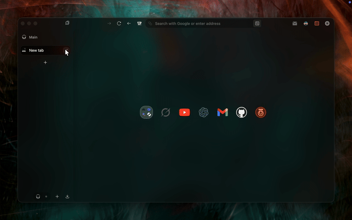

# Better Zen Start Page
<p align="center">
  
</p>

# Installation (Via Sine)
1.  Open Zen Browser Settings -> **Sine**.
3.  Paste this repo URL: `https://github.com/aree6/Better_Zen_Start_Page`
4.  Click **Install**.


## ⚠️ Install the Font
This mod uses **Libre Baskerville** for the logo. You **must** install it manually if you want to match the look exactly.

1.  **[Download Libre Baskerville](https://fonts.google.com/specimen/Libre+Baskerville)** (Google Fonts).
2.  Click **"Get Font"** -> **"Download all"**.
3.  **Windows:** Unzip -> Right Click `.ttf` files -> "Install".
4.  **Mac:** Unzip -> Double Click `.ttf` files -> "Install Font".
5.  **Restart Zen Browser.**


## Other Features

### Enabled by Default:
*   **[ON] Start Page Logo:** Adds the animated "Welcome to a calmer internet" SVG to your new tab.
*   **[ON] Fade In Transparent Background:** Adds a subtle gradient fading in from the left, making the browser stack feel seamless and spacious.

### Optional (Disabled by Default):
*   **[OFF] Transparent Tabs & Dot Indicator:** Removes tab backgrounds and adds a notification dot for open apps.
*   **[OFF] Clean UI:** Hides the bookmarks toolbar and harsh borders.
*   **[OFF] Pending Tab Status:** Adds a moon icon 🌙 and dims unloaded tabs.
*   **[OFF] Essentials Grid:** Optimizes the layout of the essentials panel.


# **Set as New Tab Page also**

> *Optional tweak* (if you want this as your new tab page also)

1. Set **Homepage**, **New Windows**, and **New Tabs** to **Bonjourr** in Zen settings  
2. Open a new tab → click the **gear icon** (bottom-right)  
3. Scroll to **Custom CSS**  
4. Paste this at the end:
```css
/* =========================================================
 *  CALMER INTERNET x BONJOURR
 * ========================================================= */

/* 1. Font Import (Must be at the very top) */
@import url('https://fonts.googleapis.com/css2?family=Libre+Baskerville:ital,wght@0,400;0,700;1,400&display=swap');

/* 2. Define Variables (The Logo & Gradient) */
:root {
  /* --- Light Mode Setup --- */
  --zen-fade-bg: linear-gradient(
    to right, 
    rgba(0,0,0,0.1) 0%, 
    rgba(0,0,0,0.025) 2%, 
    transparent 4%, 
    transparent 100%
  );

  /* Light Mode SVG */
  --zen-logo-svg: url("data:image/svg+xml;utf8,<svg xmlns='http://www.w3.org/2000/svg' viewBox='0 0 1000 500'><style>@keyframes hybridEnter{0%{opacity:0;transform:translateY(25px);letter-spacing:0.2em;filter:blur(6px)}100%{opacity:1;transform:translateY(0);letter-spacing:0;filter:blur(0)}}@keyframes colorBloom{0%{fill:%23222222;letter-spacing:0}100%{fill:%23B84B39;letter-spacing:0.05em}}text{font-family:Junicode,Libre Baskerville,serif;font-weight:500;font-size:7.5em;text-anchor:middle;fill:%23222222}.line1{animation:hybridEnter 0.7s cubic-bezier(0.22,1,0.36,1) forwards}.line2{opacity:0;animation:hybridEnter 0.7s cubic-bezier(0.22,1,0.36,1) 0.14s forwards}.coral{font-style:italic;display:inline-block;animation:colorBloom 0.4s ease-out 0.84s forwards;fill:%23222222}</style><text x='50%25' y='42%25' class='line1'>welcome to</text><text x='50%25' y='70%25' class='line2'>a <tspan class='coral'>calmer</tspan> internet</text></svg>");
}

/* --- Dark Mode Setup --- */
@media (prefers-color-scheme: dark) {
  :root {
    --zen-fade-bg: linear-gradient(to right, rgba(0,0,0,0.15) 0%, rgba(0,0,0,0.03) 2%, transparent 4%, transparent 100%);
    
    /* Dark Mode SVG (Lighter Text) */
    --zen-logo-svg: url("data:image/svg+xml;utf8,<svg xmlns='http://www.w3.org/2000/svg' viewBox='0 0 1000 500'><style>@keyframes hybridEnter{0%{opacity:0;transform:translateY(25px);letter-spacing:0.2em;filter:blur(6px)}100%{opacity:1;transform:translateY(0);letter-spacing:0;filter:blur(0)}}@keyframes colorBloom{0%{fill:%23CEC6BC;letter-spacing:0}100%{fill:%23E07B69;letter-spacing:0.05em}}text{font-family:Junicode,Libre Baskerville,serif;font-weight:500;font-size:7.5em;text-anchor:middle;fill:%23CEC6BC}.line1{animation:hybridEnter 0.7s cubic-bezier(0.22,1,0.36,1) forwards}.line2{opacity:0;animation:hybridEnter 0.7s cubic-bezier(0.22,1,0.36,1) 0.14s forwards}.coral{font-style:italic;display:inline-block;animation:colorBloom 0.4s ease-out 0.84s forwards;fill:%23CEC6BC}</style><text x='50%25' y='42%25' class='line1'>welcome to</text><text x='50%25' y='70%25' class='line2'>a <tspan class='coral'>calmer</tspan> internet</text></svg>");
  }
}

/* 3. Hide Default Bonjourr Backgrounds */
#background-media,
#background-color {
  display: none !important;
}

/* 4. Apply The Zen Background to Body */
body {
  /* Background Logic */
  background-image: var(--zen-logo-svg), var(--zen-fade-bg) !important;
  background-position: center 45%, 0% 0% !important;
  background-size: 60% auto, 100% !important;
  background-repeat: no-repeat, repeat !important;
  background-attachment: fixed !important; /* Keeps it static like a wallpaper */
  
  /* Text Colors */
  background-color: var(--bg-surface) !important;
  color: var(--text-color) !important;
  -webkit-font-smoothing: antialiased;
  -moz-osx-font-smoothing: grayscale;
}

/* 5. UI Cleanup (Credits, Inputs, Links) */

/* Keep credits accessible but tucked away */
#credit {
  visibility: hidden;
  opacity: 0;
  transition: opacity 0.24s ease, visibility 0.24s ease;
  color: var(--muted);
}
#credit-container:hover #credit {
  visibility: visible;
  opacity: 1;
}

/* Inputs, links, UI elements get readable colours */
a, a:visited { color: var(--accent-color) !important; }

input, textarea, button, select {
  color: var(--text-color) !important;
  background-color: transparent !important;
  border-color: rgba(0,0,0,0.08);
}

/* Adjust borders for dark mode */
@media (prefers-color-scheme: dark){
  input, textarea, button, select {
    border-color: rgba(255,255,255,0.08);
  }
}
```
---